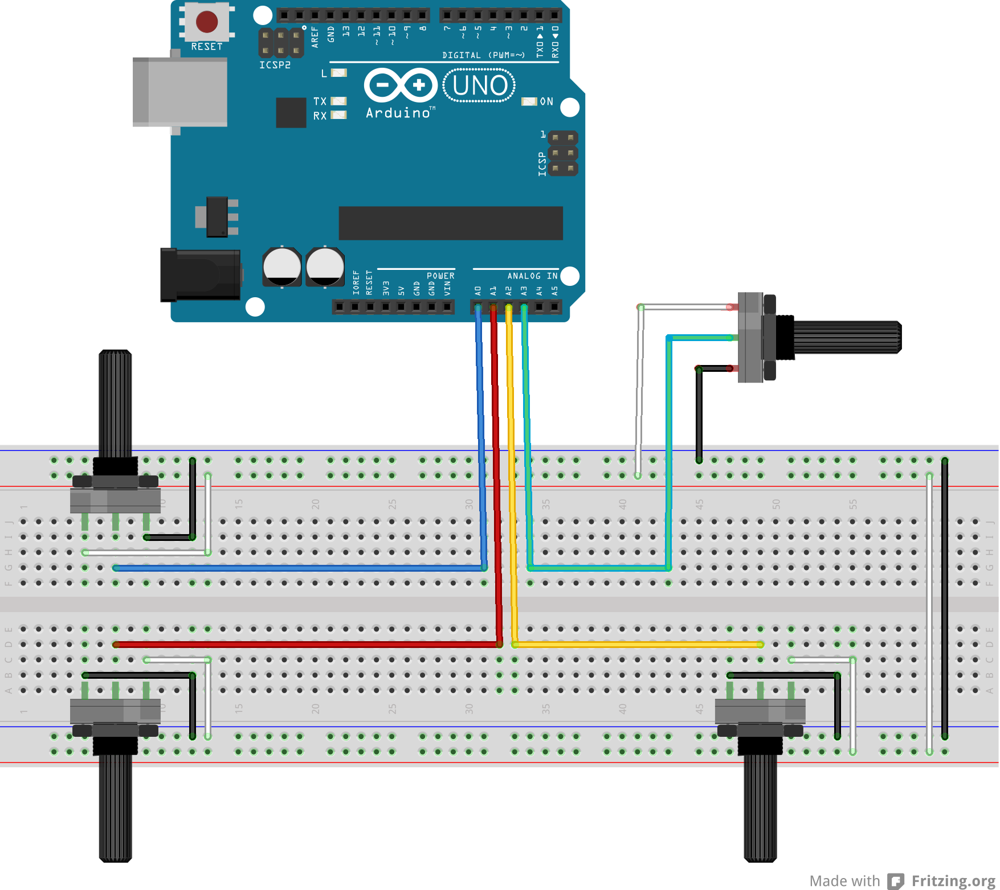

# Flight Simulator Controller (Arduino UNO)
Este tutorial esta enfocado en la creación de un mando de videojuegos que funcione para Flight Simulator. 
(The focus of this tutorial is make a gamepad for Flight Simulator).

## Componentes - Components
Para la creación del mando se necesitan los siguientes componentes:
(The next list shows the components to make the gamepad)
- 1 Arduino UNO con un cable de conexión a la computadora
- 1 Placa de pruebas (Protoboard)
- 4 Potenciómetros de 1k (Potentiometers)
- Cables para realizar las conexiones (Cables to wire)

## 1 - Diagrama de conexión - Wiring diagram
La siguiente imagen muestra las conexiones de los elementos:
(The next image shows the wiring between the components)

Format: 

## 2 - Código arduino - Arduino code
Se neces 

## Controles - Controls
Las superficies para las que funcionará 