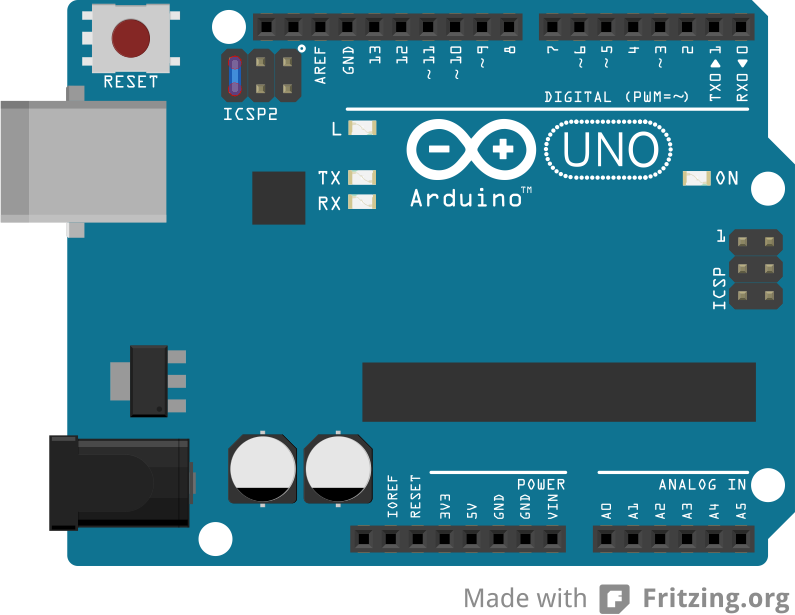
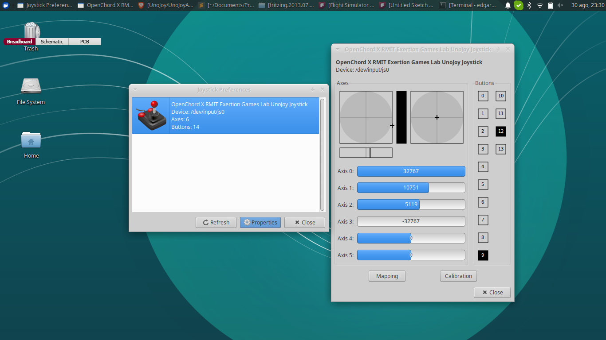

# Flight Simulator Controller (Arduino UNO)
Este tutorial esta enfocado en la creación de un mando de videojuegos que funcione para Flight Simulator.

## 1 -Componentes
Para la creación del mando se necesitan los siguientes componentes:
- 1 Arduino UNO R3 con un cable de conexión a la computadora.
- 1 Placa de pruebas.
- 4 Potenciómetros de 1k.
- Cables para realizar las conexiones.

## 2 - Diagrama de conexión
La siguiente imagen muestra las conexiones de los elementos:

Format: 

## 3 - Descargar libreria UnoJoy
UnoJoy es un proyecto que nos permite convertir nuestro Arduino UNO en un mando de videojuegos. El proyecto se encuentra disponible en el siguiente repositorio https://github.com/AlanChatham/UnoJoy . Podemos descargarlo desde la página de Github ó podemos correr el siguiente comando:
```bash
git clone https://github.com/AlanChatham/UnoJoy.git
```
UnoJoy ofrece soporte para diferentes versiones de Arduino, la que utilizaremos es la versión para Arduino UNO ubicada en la carpeta UnoJoy. Los archivos que encontramos en esta carpeta son importantes en los siguientes pasos.

## 4 - Código arduino - Arduino code
Dentro de la carpeta "Flight_Simulator_Controller" se encuentran los siguientes archivos:
- UnoJoy.h
- Flight_Simulator_Controller.ino

### 4.1 - UnoJoy.h
Es una libreria que nos permite manejar nuestro Arduino UNO como un mando de juegos via USB, para más información consultar la página https://github.com/AlanChatham/UnoJoy .

### 4.2 - Flight_Simulator_Controller.ino
El código de este archivo es utilizado para leer la información analógica que se detecte en los potenciomentros y traducirlos a señales que serán utilizadas por UnoJoy para representar un mando de videojuegos. Mediante está traducción se controlarán superficies del avión que se encargen de la velocidad, el alabeo y el cabeceo. 

## 5 - Cargar proyecto al Arduino
Cargamos nuestro proyecto en placa Arduino UNO. Es importante cargar primero el proyecto en la placa ya que posteriormente cambiaremos la configuración de nuestro Arduino UNO y no podremos cargarlo.

## 6 - Modo DFU - DFU (Device Firmware Update)
El modo DFU (Device Firmware Update) nos permitirá utilizar nuestro arduino como si fuera un periferico conectado por USB, lo cual nos favorecerá para ser detectado como si fuera un mando de videojuegos. Para más información consultar la página https://www.arduino.cc/en/Hacking/DFUProgramming8U2 .

### 6.1 - Entrar y salir del modo DFU
Para lograr ingresar en este modo es necesario conectar 2 de los pines macho ICSP ubicados entre las entradas digitales y el botón de reiniciar el Arduino. Los pines que se deben de conectar son los siguientes:

Format: 
Una vez conectadas las entradas los leds naranjas parpadearán y posteriormente quedará un led naranja encendido. Es importante mencionar que este modo perdura mientras el Arduino sea alimentado con voltaje, en el momento que se le deje de proporcionar se reiniciará el Arduino y saldrá de el modo DFU. Podemos comprobar si nos encontramos en este modo con base en los leds naranja. 

### 6.2 - Descargar un gestor de DFU
Con el objetivo de facilitar el cambio de configuraciones podemos descargar un gestor, dependiendo del sistema operativo en el que nos encontremos podemos utilizar un gestor u otro. En la siguiente página https://www.arduino.cc/en/Hacking/DFUProgramming8U2, en la sección "Download a DFU Programmer" podremos encontrar un gestor de DFU según nuestro sistema operativo. 

### 6.3 - Cambiar la configuración del Arduino
Con el arduino en el modo DFU procederemos a cambiar su configuración, para ello nos ubicamos en la carpeta donde tenemos descargado el repositorio de UnoJoy, en caso de no tenerlo consulte el punto 2. Los archivos que necesitamos para cambiar la configuración son aquellos que se llaman "TurnIntoAJoystick" y "TurnIntoAnArduino", dependiendo de el sistema operativo en el que nos encontremos ejecutamos nuestro comando (Es posible que necesitemos permisos de administrador para correr el comando).

### 6.4 - Comprobación del mando de videojuegos
Despues de haber ejecutado el comando procedemos a desconectar el arduino de nuestra fuente de voltaje para posteriormente volverlo a conectar. Una vez realizado este proceso podemos dirigirnos a nuestro gestor de mandos y podremos comprobar su funcionamiento.

Format: 

## 7 - Configuración en Flight Simulator
El último paso es configurar nuestro Flight Simulator para ello nos dirigimos al juego y asignamos los valores a las superficies y controles que deseemos. 

## 8 - Regresar al modo normal de Arduino
Si queremos regresar a la configuración inicial de nuestro Arduino, necesitamos entrar en el modo DFU y ejecutar el comando "TurnIntoAnArduino" ubicado dentro de la carpeta UnoJoy del repositorio con el mismo nombre.
